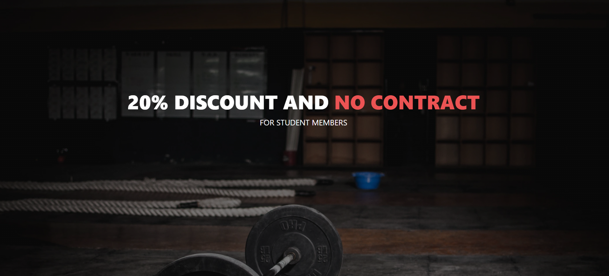

# GymBeam

[Visit the website here](https://jakbul.github.io/GymBeam/)

Created to represent local fitness centre in London and provide more information for users. This website was made for educational purposes only.

This website is made up of the following sections:

1. Home/Introduction
2. Students
3. Gallery
4. Contact

The business goals for this website are:

1. To promote our brand in the online world
2. To inspire users to visit the gym and furthermore get new costumers
3. To be reachable for customers with contact form
4. To build a database of users to send future information & content to, build an audience

The user goals of this website are:
1. As a first-time visitor, I want to easily find useful information about the gym, classes and facilities
2. As a recurring or first-time visitor, I want to be able to sign up to directly receive content via newsletter
3. As a first-time visitor, I want to be able to contact the gym with any further question
4. As a first-time visitor, I want to easily find information about special offer for students
5. As a recurring or first-time visitor, I want to be able to see how the gym looks like thanks to the gallery section

## UX

### **Strategy**

Considering the core UX principles I first started to think about the strategy for this website and defined who the target users would be and what features/technologies they would want.

GymBeam target users are:
* Aged 15-60
* Gym lovers trying to discover their potential
* People interested in fitness, healthy diet, martial arts, running or bycicle sessions
* Have an interest to reach new goals, motivation to reach a higher level of themselves

What these users would be looking for:
* Clear and easy-to-find information
* Beautiful photos that provide inspiration and make the destinations look desirable
* Facilities, special offers and classses to try use to

This website will offer all of these things whilst also allowing for intuitive navigation and comfortability of use. An effort was taken to not provide an overwhelming amount of information at first glance as this is often the reason people are put off with local gyms.

Due to the age group of the users, it is assumed that most users will be viewing the site not only on their mobile phones, but also on the tablets or computers. Therefore, creating something responsive is integral to the design.

### **Scope**

In order to achieve the desired user & business goals, the following features will be included in this release:

- Logo, header and menu bar, to navigate to various sections of the page
- Hero image section with inspirational quote
- Discover section below including short information about the gym
- Personal training section with desirable text
- Section with offer and pop-up window to sign up for newsletter
- Section with facilites and popular classes
- Follow up section with button linked to contact page
- Footer with brief information, quick links and opening times
- Dedicated webpage for students offer
- Dedicated webpage for gallery of images from the gym
- Dedicated webpage for contact form with address and phone number
- Links to affiliate social media pages in the footer

### **Structure** 

This is a multi-page website to give more space for dedicated pages. 

Users can simply scroll through the information as it is displayed or they can use the navigation bar at the top which allows them to easily move to whatever webpage of the site they are interested in. I chose the following order for the information 'Home > Students > Gallery > Contact', as I felt this would allow the information to be digested in the best way. The text blocks are enriched with images to ensure interest is kept and there is no information overload at any point. Finally, there is a simple contact form for users to be able to reach us with any questions.

### **Skeleton**

Whilst building the website I felt that there were sections with too much information about prices, classes and coaches. For this reason, I shortened or deleted some of the content of sections and simply added section with facilities using FontAwesome icons, newsletter section and follow-up contact us section. I felt it provides the user a positive user experience, it's easier to 'digest' the content while scrolling through images with less text information.

However, if user needs additional information before visiting us, he can simply contact us thanks to contact page where we can briefly answer any questions.

I also decided to resize my images in gallery by 50% to make them smaller and change their format to webp, as I felt it looked cleaner and improved the loading phase of our page. It also allowed for better responsiveness and the images looked better.

### **Surface**

I chose a colour palette based around white & black as these colours are elegant and simple to implement into design with more images on the webapge. I paired these with a lighter red colour to show appropriate contrast. 

- `#000000` used for primary text or background
- `#fafafa` used for secondary text
- `#ec5353` used for primary highlights
- `#f5634b` and `#fe9418` for hover effects
- `93c3c3` for footer

I used [coolors.co](https://coolors.co/000000-fafafa-ec5353-93c3c3-f5634b-fe9418) to help me generate my colour palette.

I used Google fonts 'Raleway' to design logo of website. I felt leaving font 'sans-serif' was a simple choice and stood out on the page in uppercase style.

- [Raleway](https://fonts.google.com/specimen/Raleway) was used for the logo

- [sans-serif](https://fonts.google.com/knowledge/glossary/sans_serif) was used for all other secondary text

- [Font Awesome](https://fontawesome.com) icons were used throughout the site, such as the facility section or social media icons in the footer

## Features

This is a fully responsive website that was designed mobile-first as this is the most likely way it will be viewed; the page is divided into four pages listed in the navbar. Where a colour or image background has been used, it has a slightly transparent opacity and the text is white, or red color used throughout the project which highlights the keywords. All of the headings the body text use font sans-serif in uppercase, this consistency has been used across the website to create a coherent design. Headings, buttons and hover effect use similar colors to build an easy-to-follow apperance.

### Existing Features

### Home Page

- **Navbar**

    - the navbar is placed on top of a responsive image which acts as a header. It includes our logo on the left side. Aswell, it immediately shows on which page the user currently is thanks to underline effect and red color. Last but not least, the navbar doesn't discourage the user to get stuck thanks to matching black color with hero image below, so it's easy to follow to another section. When viewed on smaller screens, I opted for the menu to collapse into a toggler red icon with help of Bootstrap, as seen below on second screenshot. Navbar is used on all webpages and contains the same information

- **Main Section**

    - this section continues after navbar with black background and contains hero-image of woman coach watching at a catchy quote. I used H1 element as it's main quote of the whole website. I used our red color to highlight the keyword "your dream body" as it's goal of our user - to strive for getting better and achieving the dream body

- **Details**

    - this section introduce users more information about our gym. However, I try to keep this part clean and don't overload with unnecesary details. I decided to use two cards with separate headings and add nice hover effect, as visible in screenshot below. The background color changes to white for better vissible appearance

- **Personal Training**

    - this section starts with H2 heading and is followed by paragraph containing information about possibility to work with our personal training staff. It's short, easy to read and catch the attention with image of our personal trainer with his client

- **Discover**

    - this part of website contains background image with lower opacity and heading H1 offering free first training when user signs up for our newsletter. That's important part of online business - to get e-mail of potential future customers and be able to navigate them throughout content with good e-mail marketing. Goal of section is motivate user to click on button 'Sign up' which will open the pop up window and user can sign up

- **Facilities**

    - section contains H1 heading of our highlight red color, and text with images using free FontAwesome library which shows what services can visitor expect to use in our gym. I added simple black&white colors with background to show contrast in flow of the whole website

- **Classes**

    - this sections contains H1 heading of our highlight red color, and 3 cards that shows the top popular classes in GymBeam - with name of coaches, time of sessions and image. I decided to include this part in the project to show visitor of the website examples of training provided by our personal trainers team

- **Contact follow-up**

    - last but not least, I added follow-up contact part of the page before footer to remind user that he can contact us with any question regarding to our service. It's a simple section which contains background image and H1 heading with follow up question. User will be redirected to "Contact" webpage after clicking on button "Contact us"

- **Footer**

    - last section is our footer - with logo and short information, links to social media websites where user can find us - with hover effect applied on logo of each FontAwesome image, quick links to easily navigate throughout website and opening times - with nice transition and hover effect too. Background is slightly grey to distinguish the section from others. Footer is used on all webpages and contains the same information

### Students Page

- **Offer for students**

    - this webpage starts with navbar used on the main page and finishes with the same footer as well. First section contains background image with H1 heading and second one is sale description of offer with image. It is about special offer for students as they require more flexible and cheaper option. The goal of this page is to get attention of them, because it is very important group of clients as they are more likely sharing photos during training, talking with friends about their experience and spread our brand with word-of-mouth marketing

### Gallery Page

- **Gallery from our GymBeam**

    - this webpage starts with navbar used on the main page and finishes with the same footer as well. All section is full of images to show visitors what is the experience of our client base to train with us

### Contact Page

- **Contact Form**

    - this webpage starts with navbar used on the main page and finishes with the same footer as well. This simple section contains form which visitors can use in case of any question or queries. When visitors try to get in touch, it usually means they are interested in our local gym and we can actually work in building relationships with them 

- **Confirmation**

    - I tried to make the contact form more interactive. Sadly, with lack of knowledge with JavaScript and backend processes I didn't have many options of doing it. However, my mentor Tim came with an idea to use the same webpage as is the contact form, but redirect users to home page after 10 seconds. In the end, it appears more professional and fluent

### Future Features

- **Interaction with JavaScript**
    - After learning how to enrich code with JavaScript, I will update this website and make it more dynamic. For example, hero-image can actually contains 3 or 4 of images which swipe left from one to another every 5 seconds
- **Backend programming**
    - I would like to implement work with Backend language such as Python to be able to work with e-mail databases, newsletters and make log-in section where people can book class in the gym fully online. Last but not least, I could try to build own brand of clothes and gym small equipment and sell it thanks to our webpage

## Tools & Technologies Used

- [HTML](https://en.wikipedia.org/wiki/HTML) used for the main site content
- [CSS](https://en.wikipedia.org/wiki/CSS) used for the main site design and layout
- [CSS Grid](https://www.w3schools.com/css/css_grid.asp) used for an enhanced responsive layout
- [JavaScript](https://www.javascript.com) used for user interaction on the site
- [Git](https://git-scm.com) used for version control (`git add`, `git commit`, `git push`)
- [GitHub](https://github.com) used for secure online code storage
- [GitHub Pages](https://pages.github.com) used for hosting the deployed front-end site
- [Gitpod](https://gitpod.io) used as a cloud-based IDE for development
- [Pexels](https://www.pexels.com/) used to find and download free images for project
- [Bootstrap](https://getbootstrap.com) used as the front-end CSS framework for modern responsiveness and pre-built components
- [Google Fonts](https://fonts.google.com/) used to obtain the fonts linked in the header and used in project
- [Font Awesome](https://fontawesome.com/) used to obtain the media icons
- [Google Developer Tools](https://developers.google.com/web/tools/chrome-devtools) used as a primary method of fixing spacing issues, finding bugs, and testing responsiveness across the project
- [Grammarly](https://www.grammarly.com/) used to fix the thousands of grammar errors across the project
- [Coloors](https://coolors.co/) used to create a colour palette for the design
- [Color Contrast Accessibility Validator](https://color.a11y.com/) allowed me to test the colour contrast of my webpage
- [W3C Markup Validation Service](https://validator.w3.org/) used to validate all HTML code written and used on this webpage
- [W3C CSS Validation Service](https://jigsaw.w3.org/css-validator/#validate_by_input) used to validate all CSS code written and used on this webpage
- [AmIResponsive](http://ami.responsivedesign.is/) used to generate repsonsive image used in README file

## Testing

## Code Validation

### HTML
I have used the recommended [HTML W3C Validator](https://validator.w3.org) to validate all of my HTML files.

### CSS
I have used the recommended [CSS Jigsaw Validator](https://jigsaw.w3.org/css-validator) to validate all of my CSS files.

## Deployment

The site was deployed to GitHub Pages. The steps to deploy are as follows:
- In the [GitHub repository](https://github.com/JakBul/GymBeam), navigate to the Settings tab 
- From the source section drop-down menu, select the **Main** Branch, then click "Save".
- The page will be automatically refreshed with a detailed ribbon display to indicate the successful deployment.

The live link can be found [here](https://jakbul.github.io/GymBeam)

### Local Deployment

This project can be cloned or forked in order to make a local copy on your own system.

#### Cloning

You can clone the repository by following these steps:

1. Go to the [GitHub repository](https://github.com/JakBul/GymBeam) 
2. Locate the Code button above the list of files and click it 
3. Select if you prefer to clone using HTTPS, SSH, or GitHub CLI and click the copy button to copy the URL to your clipboard
4. Open Git Bash or Terminal
5. Change the current working directory to the one where you want the cloned directory
6. In your IDE Terminal, type the following command to clone my repository:
	- `git clone https://github.com/JakBul/GymBeam.git`
7. Press Enter to create your local clone.

Alternatively, if using Gitpod, you can click below to create your own workspace using this repository.

Please note that in order to directly open the project in Gitpod, you need to have the browser extension installed.
A tutorial on how to do that can be found [here](https://www.gitpod.io/docs/configure/user-settings/browser-extension).

#### Forking

By forking the GitHub Repository, we make a copy of the original repository on our GitHub account to view and/or make changes without affecting the original owner's repository.
You can fork this repository by using the following steps:

1. Log in to GitHub and locate the [GitHub Repository](https://github.com/JakBul/GymBeam)
2. At the top of the Repository (not top of page) just above the "Settings" Button on the menu, locate the "Fork" Button.
3. Once clicked, you should now have a copy of the original repository in your own GitHub account!

## Credits

| Source | Location | Notes |
| --- | --- | --- |
| [Markdown Builder](https://traveltimn.github.io/markdown-builder) | README and TESTING | tool to help generate the Markdown files |
| [Pexels](https://www.pexels.com) | entire site | images on all pages |

## Acknowledgements

- First and foremost, I would like to thank my Code Institute mentor, [Tim Nelson](https://github.com/TravelTimN) for his support throughout the development of this project
- Secondly,  I would like to thank my Code Institute tutor, [Nigel Edwards](https://github.com/nigel-edwards) for his assistance and guidance since start of studying
- In addition, I would like to thank the [Code Institute Slack community](https://code-institute-room.slack.com) for the moral support
- Last but not least, I would like to thank my partner Angi, for believing in me, and allowing me to make this transition into software development